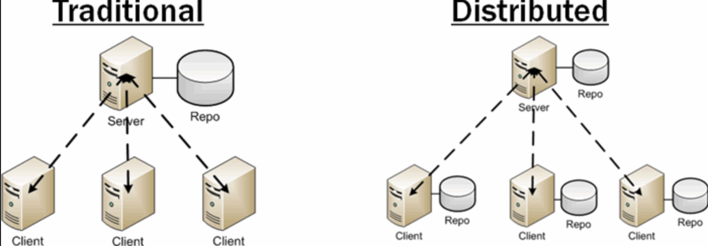
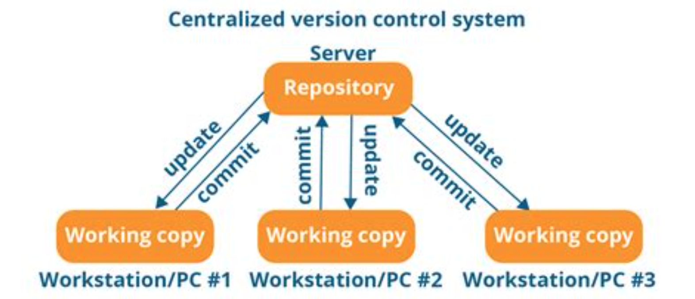
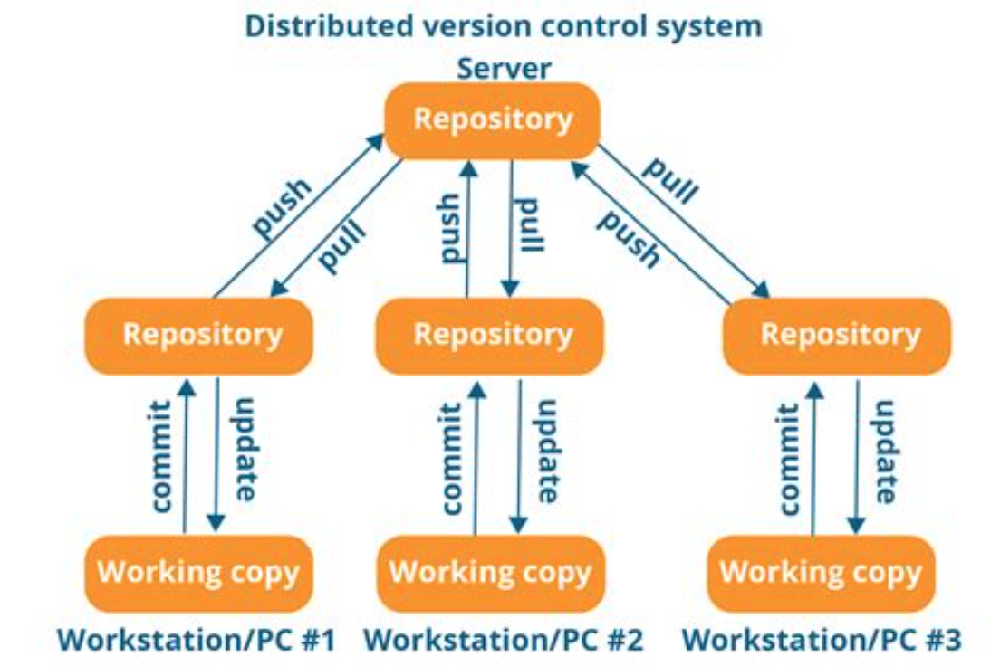

= Workspaces

== Distributed and Centralized Version Control Systems

=== Centralized versus Distributed VCS

Version Control Systems (VCS) or Configuration Management (CM) do their
work in a number of ways.  You need to understand how yours works.

* Where are the files?
* Is there a copy on the local machine?
* Do you "edit in place"?

=== Centralized Version Control System

////

////

=== Distributed Version Control System

////

////

== Physical and Logical Organization

"Workspace" is an overloaded term.  Spend some time asking what each person
thinks of when they here 'workspace'.

link:../../../courses/xtUML-Modeling/xtUML_heritage_materials/Module_2_Tools.pdf[PDF slides of Eclipse terminology]

Additional terms:

[glossary]
repository::
  file system containing files controlled by a configuration management
  (version control) system such as ClearCASE, Subversion or Git.
repository clone::
  private local **copy** of a (distributed) repository.  Git does this.
  (__Why does git do this?__)
.metadata::
  The (invisible) folder in an Eclipse workspace that holds the information
  about what the workspace contains.
.project::
  The (invisible) file which contains the information that defines to Eclipse
  what it needs to know about the files in the contained folder.

Take a tour of the file system of the repository on a Windows machine.

* See the .project files.
* See the models and gen folders.

From Windows, navigate to the repository ("across the network") on my Mac.

* Create a new workspace and Import Existing Projects 'einstein', 'Pub', 'wx'.

What do you think we will find inside the workspace folder?

From Windows, navigate to the workspace folder and see what is inside.
